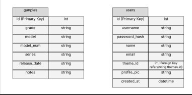
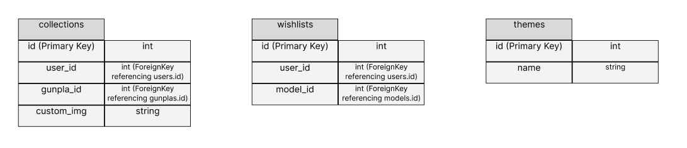
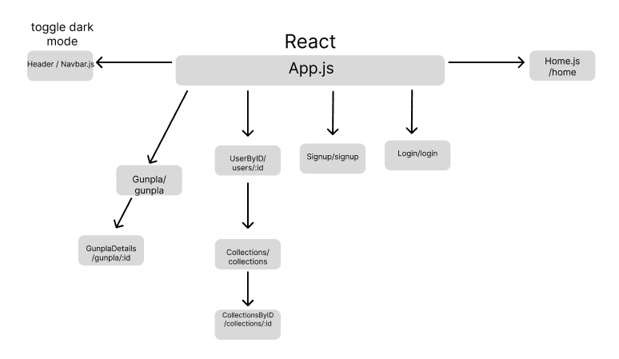
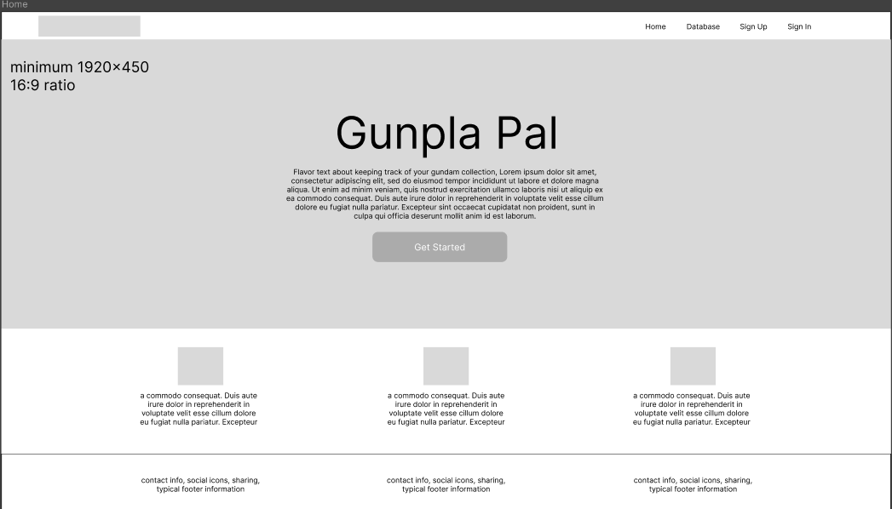
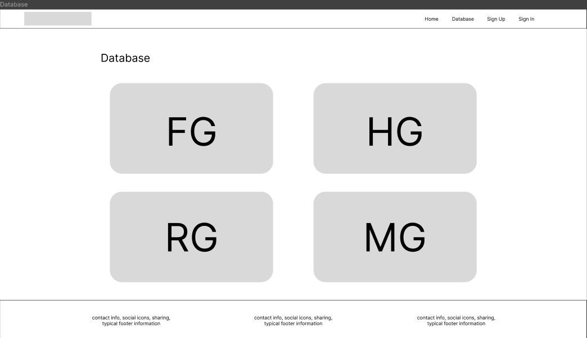
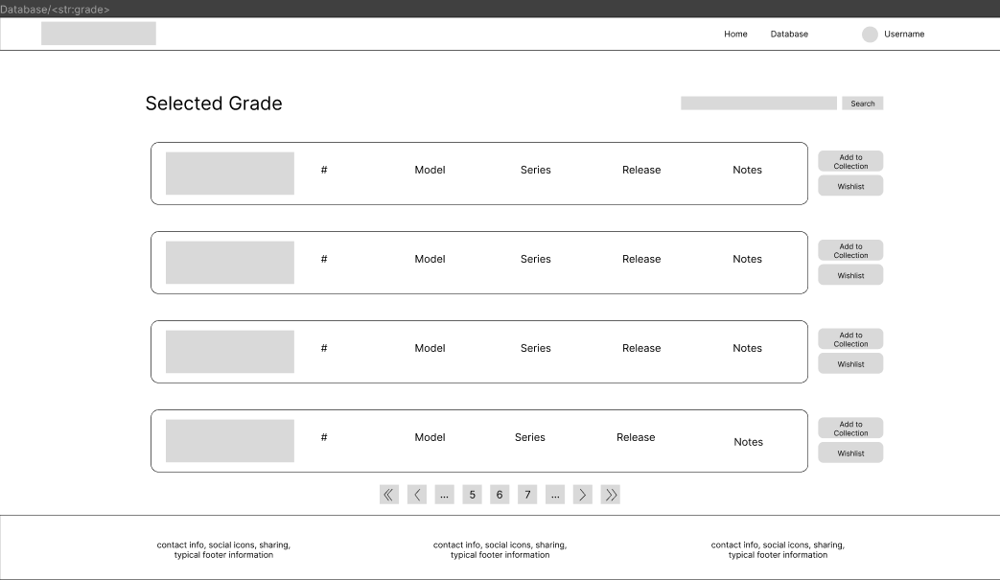
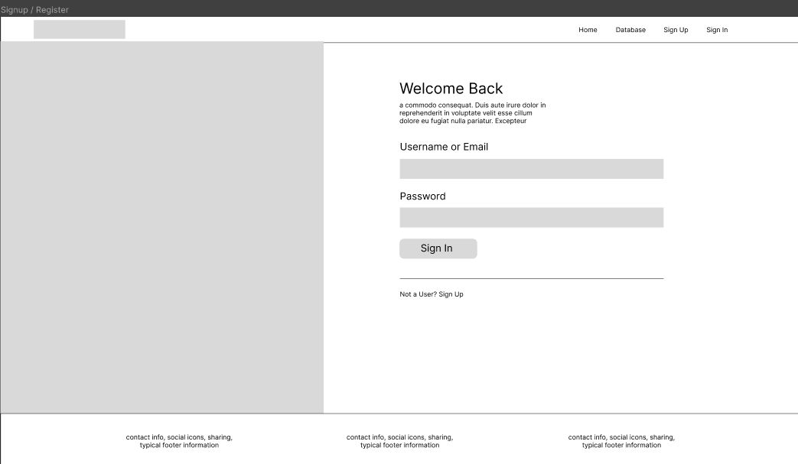
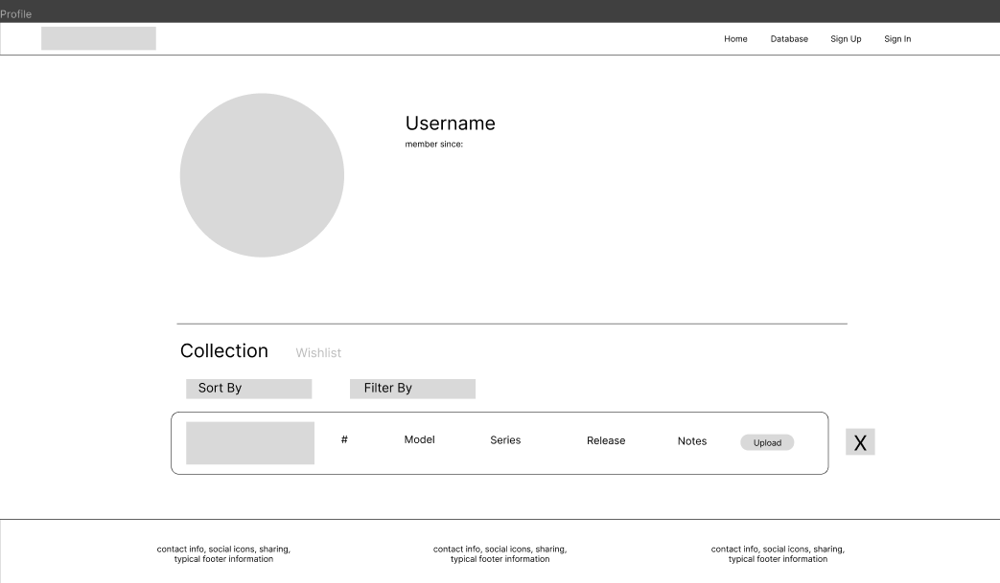
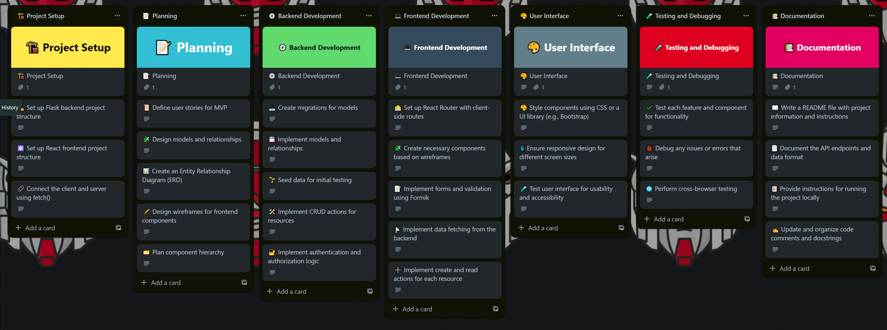

# Gunpla-Pal

### Users will be able to...

1. Create an account so that I can start tracking my gunpla collections. 
2. Customize my account with a profile picture. 
3. Access and manage my gunpla collections once I have logged in.
4. View gunpla models from the database.
5. Filter / search gunpla models by various fields. 
6. View details of a selected gunpla.
7. Be able to add gunpla to preexisting collections or to a new collection. 
8. Name my collection to accommodate how I would like to organize my gunpla (ex. To build, built, wishlist).

### Stretch Goals...

1. ‘Like’ feature for gundam models. Be able to filter gundam by ‘number of likes’.
2. ‘Follow’ feature for users to be able to follow each other’s profiles and collections. 
3. Achievement & badge system for profile.
4. Add a forum / comments section, difficulty ratings & ability to like / favorite -> potential for a "Hottest" section or a "Beginner-Friendly" section

### Classes

### React Tree

### Wireframes

### API Routes
<table>
<thead>
<th>API Route</th>
<th>Request Method</th>
<th>Body</th>
<th>Response</th>
</thead>
<tbody>
<tr>
<td>/users/int:id</td>
<td>GET</td>
<td></td>
<td>[name, email, username]</td>
</tr>
<tr>
<td>/login</td>
<td>GET</td>
<td></td>
<td></td>
<tr>
<td>/login</td>
<td>POST</td>
<td>username, password_hash</td>
<td></td>
</tr>
<tr>
<td>/logout</td>
<td>DELETE</td>
<td></td>
<td>{}</td>
</tr>
<tr>
<td>/gunplas/str:grade</td>
<td>GET</td>
<td></td>
<td>[{id, grade, model, model_num, series, release_date, notes, image_url},{...}, {...}]</td>
</tr>
<tr>
<td>/collection/user_id</td>
<td>GET</td>
<td></td>
<td>[{id, user_id, gunpla_id, custom_img}]</td>
</tr>
<tr>
<td>/collection/user_id</td>
<td>POST</td>
<td>{user_id, gunpla_id}</td>
<td>{id, user_id, gunpla_id, custom_img}</td>
</tr>
<tr>
<td>/collection/user_id</td>
<td>PATCH</td>
<td>{custom_img}</td>
<td>{id, user_id, gunpla_id, custom_img}</td>
</tr>
<tr>
<td>/collection/user_id</td>
<td>DELETE</td>
<td></td>
<td>{}</td>
</tr>
<tr>
<td>/wishlist/user_id</td>
<td>GET</td>
<td></td>
<td>[{id, user_id, gunpla_id, custom_img}]</td>
</tr>
<tr>
<td>/wishlist/user_id</td>
<td>POST</td>
<td>{user_id, gunpla_id}</td>
<td>{id, user_id, gunpla_id, custom_img}</td>
</tr>
<tr>
<td>/wishlist/user_id</td>
<td>PATCH</td>
<td>{custom_img}</td>
<td>{id, user_id, gunpla_id, custom_img}</td>
</tr>
<tr>
<td>/wishlist/user_id</td>
<td>DELETE</td>
<td></td>
<td>{}</td>
</tr>
</tbody>
</table>

### Trello
